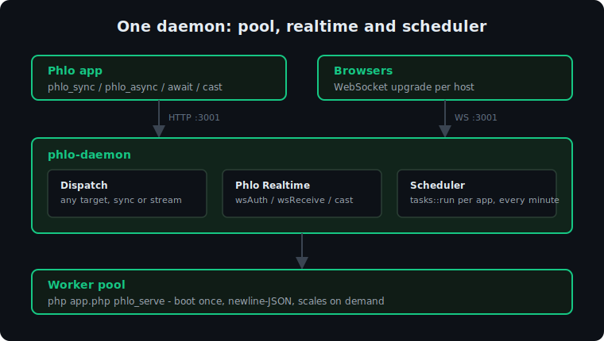

# phlo-daemon

An optional per-host node sidecar for [Phlo](https://phlo.tech): a **generic central engine** that
dispatches any Phlo target to a pool of persistent `phlo_serve` workers.

Core Phlo always works without it: every target is callable as a one-shot CLI process
(`php app.php <target> [args...]`). The daemon is purely an **extension**:

1. a **worker pool** that runs those same calls far more performantly (boot the app once, reuse the
   worker, instead of a fresh process per call), and
2. the **enabler for websockets and scheduled tasks**, which need a long-lived host process.

The daemon's dispatch core knows nothing about any specific feature. The WebSocket server and the
scheduler are built in; the PHP runtime helpers (`phlo_sync`/`phlo_async`/…) reach it over HTTP.



## Worker protocol

Each worker runs `php <app.php> phlo_serve`, boots the app once, then answers newline-JSON requests
on stdin (one in flight per worker; concurrency = pool size):

```
in   {"id","target","args"?,"stream"?}
out  {"t":"ready"}                                  // once, after boot
     {"id","t":"line","data"}                       // 0..N, only when stream
     {"id","t":"done","result"} | {"id","t":"error","message"}   // exactly one, terminal
```

Per request the worker resets state (`phlo('tech/reset')` + session close + GC), mirroring the
FrankenPHP HTTP worker loop, so jobs never leak into each other.

## HTTP API

Binds `127.0.0.1` by default (local-only; gate at the network boundary).

- `POST /dispatch` `{app, target, args?, stream?, async?}`: `app` is the absolute `…/app.php` path
  to run (the pool is keyed by it). The runtime helpers use this; a caller that knows its own app
  needs no host→app config.
  - response: default `{status:"ok", result}`; `async:true` → `202 {status:"ok", queued:true}`;
    `stream:true` → an `application/x-ndjson` stream of `{t:line,data}*` then `{t:done,result}` /
    `{t:error}` (used for streaming output, e.g. websocket `receive`)
- `POST /message` `{host, target, data}`: the broadcast bridge the websocket pushes through.
- `GET /health`: `{workers, cap, pools, sockets, registered}` — live worker total vs cap, per-pool
  stats keyed by app path (`workers`, `busy`, `queued`), connected sockets per host, configured hosts.

## Configuration

```js
require('phlo-daemon')(port, phpBinary, hosts?)
```

No pool sizing: each pool scales on demand up to a cap of one less than the core count, reaping idle
workers. The `hosts` argument is the host→app map of every app the daemon serves (the sole source of
truth; there is no self-registration), and one-shot vs pooled follows each host's `build` flag in it
(a `build: true` dev app runs one-shot; a release app is pooled).

```js
require('./phlo-daemon.js')(3001, '/usr/bin/php-zts', {
  'app.example.com':  { app: '/srv/app/www/app.php',  build: false },
  'demo.example.nl':  { app: '/srv/demo/www/app.php', build: true },
})
```

- `hosts`: the host→app map, `{ host: { app, build } }`, declared in `config/daemon.js` and loaded
  into the registry at startup. It is the sole source of truth for the apps the daemon serves and
  drives everything: dispatch pools, websocket routing, and the cron-replacing `tasks::run` minute
  tick on every served app (first run one minute after boot). Which tasks fire, and how often, is
  declared in the app itself (`%app->tasks`), never here; an app that does not load the tasks
  resource is skipped automatically.
- `PHLO_DAEMON_IDLE_MS` / `PHLO_DAEMON_REAP_MS`: env overrides for the idle timeout and the reap sweep.

## Consumers

- **Phlo Realtime** (the daemon's built-in WebSocket layer): the WebSocket server runs
  in-process, resolving each connection's host to an app and running the
  `websocket::{auth,connect,receive,close}` hooks on the pool (`receive` streams).
- **runtime helpers**: `phlo_sync` / `phlo_async` / `await` / `phlo_stream` route through `/dispatch`
  by `app` path when the app sets the optional `daemon` constant
  (`phlo_app(daemon: 3001)`), otherwise they keep their one-shot subprocess
  behaviour. Adopting the daemon is opt-in, never required, and needs no host→app config.
- **Phlo WhatsApp** stays its own service (persistent phone session); it is monitored, not absorbed.

The [Phlo Poll demo](https://github.com/q-ainl/phlo-demo-poll) is a small complete example of
Phlo Realtime on the daemon: one vote broadcasts to every open tab.

## Run

```sh
node config.js            # config.js requires this module with (port, php, hosts)
# or under a process manager
pm2 start config.js --name phlo-daemon
```

MIT.
